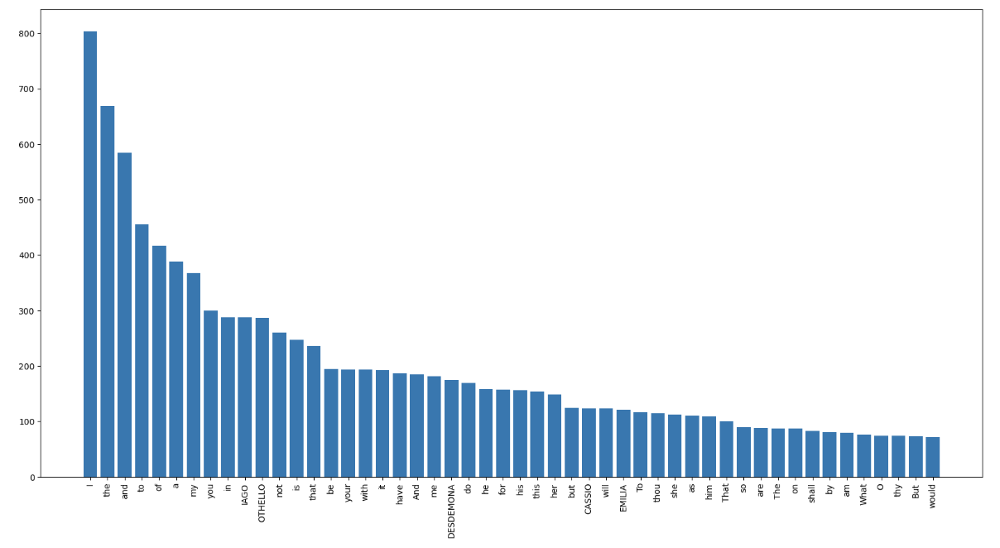

# Plotting-wordcluds

## Project Overview

**Database**: `(http://shakespeare.mit.edu/othello/full.html)`

This project is designed to demonstrate Python skills and techniques typically used by data analysts to explore, clean, and analyze wordcloud. The project involves setting up a database, cleaning up the data, formatting the text, removing unnecessary punctuations.

## Project Structure

### 1. Database Setup

```python
import nltk
#nltk.download('stopwords')
#nltk.download('punkt')
#nltk.download('words')
from nltk.corpus import stopwords, words
import string
import itertools

from wordcloud import WordCloud, STOPWORDS, ImageColorGenerator

#import pandas as pd
import matplotlib.pyplot as plt
filename = '/Users/iayushjav/Downloads/othello.txt'
with open(filename) as f:
    text = f.read()
```

### 2. Split the text into words

```python
myWords = text.split()
```

### 3. Count how many times each word is repeated

```python
wordsDict = {}
for word in myWords:
    if word in wordsDict:
        wordsDict[word] += 1
    else:
        wordsDict[word] = 1
wordsDict = dict(wordsDict[::-1])
```

### 3. Bar graph for 50 most repeated words
```python
n = 50 # just 50 most popular
wordsPlot = {k: wordsDict[k] for k in list(wordsDict)[:n]}

fig, ax = plt.subplots(figsize=(20,10))

ax.bar(range(len(wordsPlot)), list(wordsPlot.values()), align='center')

ax.set_xticks(range(len(wordsPlot)))
ax.set_xticklabels(list(wordsPlot.keys()))

plt.xticks(rotation=90)

plt.show()
```


3. **Write a SQL query to calculate the total sales (total_sale) for each category.**:
```sql
SELECT 
    category,
    SUM(total_sale) as net_sale,
    COUNT(*) as total_orders
FROM retail_sales
GROUP BY 1
```

4. **Write a SQL query to find the average age of customers who purchased items from the 'Beauty' category.**:
```sql
SELECT
    ROUND(AVG(age), 2) as avg_age
FROM retail_sales
WHERE category = 'Beauty'
```

5. **Write a SQL query to find all transactions where the total_sale is greater than 1000.**:
```sql
SELECT * FROM retail_sales
WHERE total_sale > 1000
```

6. **Write a SQL query to find the total number of transactions (transaction_id) made by each gender in each category.**:
```sql
SELECT 
    category,
    gender,
    COUNT(*) as total_trans
FROM retail_sales
GROUP 
    BY 
    category,
    gender
ORDER BY 1
```

7. **Write a SQL query to calculate the average sale for each month. Find out best selling month in each year**:
```sql
SELECT 
       year,
       month,
    avg_sale
FROM 
(    
SELECT 
    EXTRACT(YEAR FROM sale_date) as year,
    EXTRACT(MONTH FROM sale_date) as month,
    AVG(total_sale) as avg_sale,
    RANK() OVER(PARTITION BY EXTRACT(YEAR FROM sale_date) ORDER BY AVG(total_sale) DESC) as rank
FROM retail_sales
GROUP BY 1, 2
) as t1
WHERE rank = 1
```

8. **Write a SQL query to find the top 5 customers based on the highest total sales **:
```sql
SELECT 
    customer_id,
    SUM(total_sale) as total_sales
FROM retail_sales
GROUP BY 1
ORDER BY 2 DESC
LIMIT 5
```

9. **Write a SQL query to find the number of unique customers who purchased items from each category.**:
```sql
SELECT 
    category,    
    COUNT(DISTINCT customer_id) as cnt_unique_cs
FROM retail_sales
GROUP BY category
```

10. **Write a SQL query to create each shift and number of orders (Example Morning <12, Afternoon Between 12 & 17, Evening >17)**:
```sql
WITH hourly_sale
AS
(
SELECT *,
    CASE
        WHEN EXTRACT(HOUR FROM sale_time) < 12 THEN 'Morning'
        WHEN EXTRACT(HOUR FROM sale_time) BETWEEN 12 AND 17 THEN 'Afternoon'
        ELSE 'Evening'
    END as shift
FROM retail_sales
)
SELECT 
    shift,
    COUNT(*) as total_orders    
FROM hourly_sale
GROUP BY shift
```

## Findings

- **Customer Demographics**: The dataset includes customers from various age groups, with sales distributed across different categories such as Clothing and Beauty.
- **High-Value Transactions**: Several transactions had a total sale amount greater than 1000, indicating premium purchases.
- **Sales Trends**: Monthly analysis shows variations in sales, helping identify peak seasons.
- **Customer Insights**: The analysis identifies the top-spending customers and the most popular product categories.

## Reports

- **Sales Summary**: A detailed report summarizing total sales, customer demographics, and category performance.
- **Trend Analysis**: Insights into sales trends across different months and shifts.
- **Customer Insights**: Reports on top customers and unique customer counts per category.

## Conclusion

This project serves as a comprehensive introduction to SQL for data analysts, covering database setup, data cleaning, exploratory data analysis, and business-driven SQL queries. The findings from this project can help drive business decisions by understanding sales patterns, customer behavior, and product performance.
